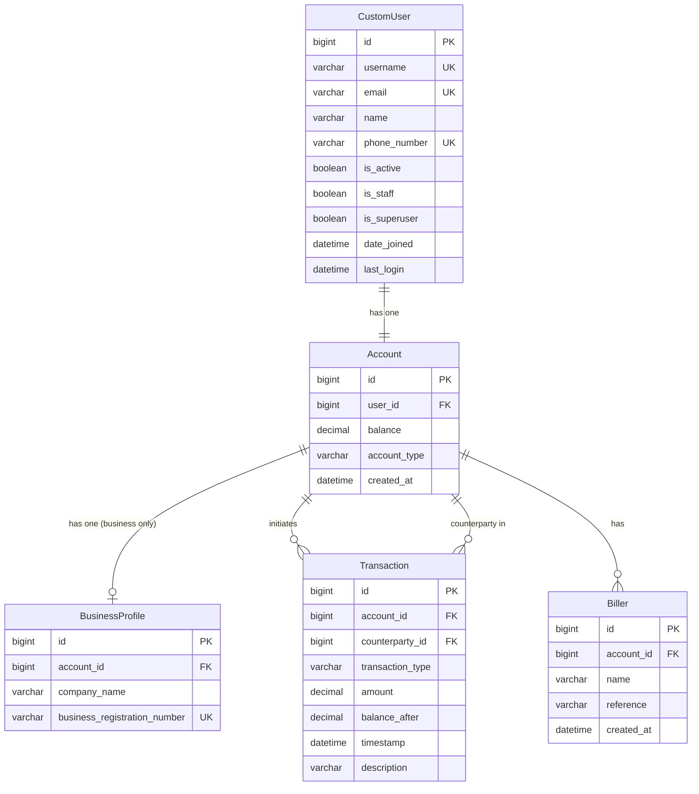

# Banking App

A Django-based banking application supporting personal and business accounts, fund transfers, and bill payments.

## Data Models

### Entity Relationship Diagram

---

### Entities

#### CustomUser

Extends Django's `AbstractBaseUser`. The primary authentication entity.

| Field | Type | Constraints |
|---|---|---|
| `id` | BigAutoField | PK, auto |
| `username` | CharField(150) | Unique, case-insensitive |
| `email` | EmailField | Unique, normalized to lowercase |
| `name` | CharField(150) | — |
| `phone_number` | CharField(8) | Unique, Singapore format `^[89]\d{7}$` |
| `is_active` | BooleanField | Default: `True` |
| `is_staff` | BooleanField | Default: `False` |
| `is_superuser` | BooleanField | Default: `False` |
| `date_joined` | DateTimeField | Default: `now` |
| `last_login` | DateTimeField | Nullable |

An `Account` is automatically created for each new `CustomUser` via a post-save signal.

---

#### Account

Represents a user's bank account. One account per user.

| Field | Type | Constraints |
|---|---|---|
| `id` | BigAutoField | PK, auto |
| `user` | OneToOneField → CustomUser | Cascade on delete |
| `balance` | DecimalField(12, 2) | Default: `0.00` |
| `account_type` | CharField(10) | Choices: `PERSONAL`, `BUSINESS` |
| `created_at` | DateTimeField | Auto on create |

---

#### BusinessProfile

Optional additional details for `BUSINESS` accounts. One profile per account.

| Field | Type | Constraints |
|---|---|---|
| `id` | BigAutoField | PK, auto |
| `account` | OneToOneField → Account | Cascade on delete |
| `company_name` | CharField(200) | — |
| `business_registration_number` | CharField(20) | Unique, `^[A-Za-z0-9]{6,20}$` |

---

#### Transaction

Immutable audit log of all balance changes. Never deleted, never updated.

| Field | Type | Constraints |
|---|---|---|
| `id` | BigAutoField | PK, auto |
| `account` | ForeignKey → Account | PROTECT on delete |
| `transaction_type` | CharField(20) | Choices: `DEPOSIT`, `WITHDRAWAL`, `TRANSFER_OUT`, `TRANSFER_IN`, `BILL_PAYMENT` |
| `amount` | DecimalField(12, 2) | — |
| `balance_after` | DecimalField(12, 2) | — |
| `counterparty` | ForeignKey → Account | Nullable, SET_NULL on delete |
| `timestamp` | DateTimeField | Auto on create |
| `description` | CharField(200) | Optional |

Default ordering: `-timestamp` (newest first).

The `counterparty` field is populated only for `TRANSFER_OUT` and `TRANSFER_IN` transactions and points to the other party's account.

---

#### Biller

A saved payee for recurring bill payments, scoped to an account.

| Field | Type | Constraints |
|---|---|---|
| `id` | BigAutoField | PK, auto |
| `account` | ForeignKey → Account | Cascade on delete |
| `name` | CharField(50) | Choices: `ELECTRICITY`, `WATER_UTILITIES`, `INTERNET_BROADBAND`, `TELECOMMUNICATIONS`, `TOWN_COUNCIL` |
| `reference` | CharField(100) | — |
| `created_at` | DateTimeField | Auto on create |

Composite unique constraint on `(account, name, reference)` — the same biller/reference pair cannot be added twice to the same account.

---

### Relationships Summary

| Relationship | Type | Notes |
|---|---|---|
| `CustomUser` → `Account` | One-to-One | Created automatically on user registration |
| `Account` → `BusinessProfile` | One-to-One (optional) | Only for `BUSINESS` account type |
| `Account` → `Transaction` | One-to-Many | `account` field — transactions initiated by this account |
| `Account` → `Transaction` | One-to-Many | `counterparty` field — transfer transactions involving this account |
| `Account` → `Biller` | One-to-Many | Saved billers belonging to this account |
